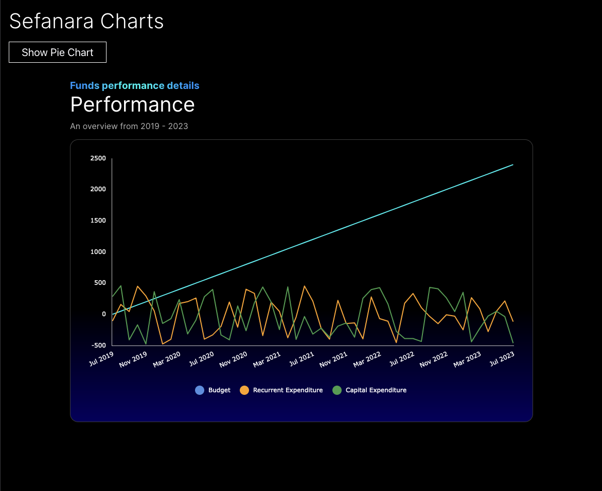
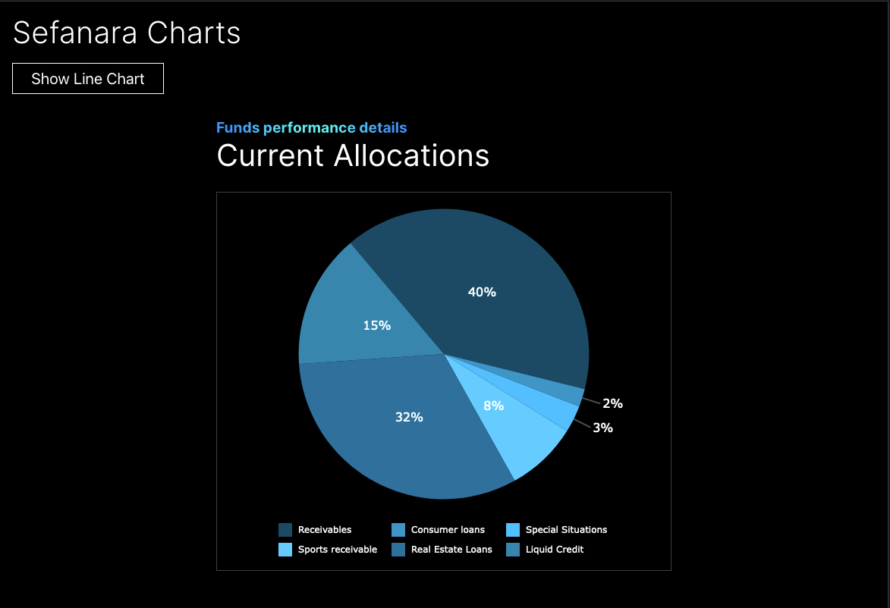

# Sefanara

This is the take home assessment from Fasanara

Line Chart

Pie Chart

## Getting Started

### Run

- `yarn install or pnpm install or npm install (Depending on your package manager)`
- `pnpm dev`

Tools Used:

- React + Typescript, and Vanilla CSS for styling.
- Core package: `AgReactCharts`

#### Live links

- live url: https://tobe-fasanara.vercel.app/
- repository: https://github.com/amaify/fasanara
